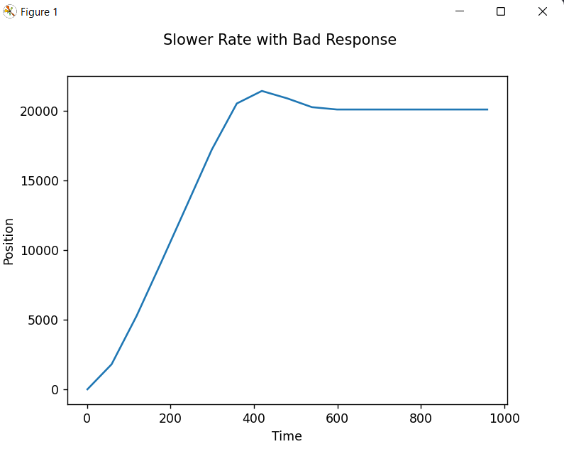
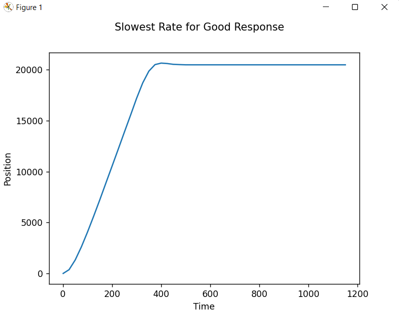

# Lab 3

## Time Scheduled Multitasking

### By: Benny Cruz, Arfan Ansar, Noah Johnson

We began by downloading the cotask, taskshare, and basic task files
from the ME 405 support repository on Github.

Similar to lab 2 we run the motor task and pint the results and
plot the step response. The task is continuously run at a slower 
and slower rate until the controller's performance has significantly
gotten worse compared to the optimal response. This is done to choose
an optimal run rate for the motor control task. The plots for both
the .....response and .....response can be seen below.

A task was created to run two motors simultaneously under closed-loop
control. This test program moves the motors different distances and holds
them at the desired positions.

